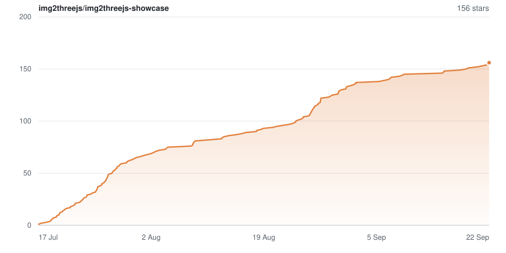

<div align="center">

# img2threejs&nbsp;·&nbsp;showcase

**One reference photo in. A code-only, animation-ready 3D model out.**

A live gallery of procedural Three.js models generated by
[img2threejs](https://github.com/hoainho/img2threejs). No imported meshes, no
downloaded art packs, no `.glb` fetched at runtime — every exhibit below is a
TypeScript factory function, running live in your browser.

[](https://img2threejs.io/)
[](https://discord.gg/8DS8RTyuR)

[](https://github.com/hoainho/img2threejs-showcase/stargazers)
[](https://github.com/hoainho/img2threejs-showcase/actions/workflows/deploy.yml)
[](https://github.com/hoainho/img2threejs-showcase/actions/workflows/pr-safety-check.yml)
[](https://threejs.org/)


Click any card for the full-viewport viewer (`#/demo/:id`): drag to orbit,
scroll to zoom, and read the reference photo it was rebuilt from.

</div>

---

## Contents

- [Featured exhibits](#featured-exhibits)
- [All exhibits](#all-exhibits)
- [What makes these different](#what-makes-these-different)
- [Add your own showcase](#add-your-own-showcase)
- [Stack](#stack)
- [Develop](#develop)
- [Project layout](#project-layout)
- [Swapping in a placeholder demo](#swapping-in-a-placeholder-demo)
- [Community](#community)
- [Support the project](#support-the-project)
- [Star history](#star-history)

## Featured exhibits

<table>
<tr>
<td width="33%" align="center">
<a href="https://img2threejs.io/#/demo/sony-wf1000xm3"></a><br>
<b><a href="https://img2threejs.io/#/demo/sony-wf1000xm3">Sony WF-1000XM3</a></b><br>
<sub>The lid opens, both buds rise and spin a full turn, then settle back.</sub>
</td>
<td width="33%" align="center">
<a href="https://img2threejs.io/#/demo/issaca-shotgun"></a><br>
<b><a href="https://img2threejs.io/#/demo/issaca-shotgun">ISSACA 12 Gauge</a></b><br>
<sub>Muzzle flash, full recoil kick, and a brass slug that ejects and tumbles.</sub>
</td>
<td width="33%" align="center">
<a href="https://img2threejs.io/#/demo/gerber-knife"></a><br>
<b><a href="https://img2threejs.io/#/demo/gerber-knife">Gerber Paracord Knife</a></b><br>
<sub>Skeletonized tanto under ~13 turns of woven orange kernmantle cord.</sub>
</td>
</tr>
<tr>
<td width="33%" align="center">
<a href="https://img2threejs.io/#/demo/doraemon-house"></a><br>
<b><a href="https://img2threejs.io/#/demo/doraemon-house">Doraemon House</a></b><br>
<sub>Isometric diorama: swaying canopies, twinkling dusk windows, two residents.</sub>
</td>
<td width="33%" align="center">
<a href="https://img2threejs.io/#/demo/warhauler"></a><br>
<b><a href="https://img2threejs.io/#/demo/warhauler">War-Hauler "SECTOR 07"</a></b><br>
<sub>Armored 6-wheeler with glowing reactor hubs and drifting exhaust smoke.</sub>
</td>
<td width="33%" align="center">
<a href="https://img2threejs.io/#/demo/crown-chest"></a><br>
<b><a href="https://img2threejs.io/#/demo/crown-chest">Crowned Loot Chest</a></b><br>
<sub>Purple-to-teal enamel and an emissive crown. <i>Placeholder mesh.</i></sub>
</td>
</tr>
</table>

## All exhibits

✅ `final` is a real img2threejs reconstruction measured against its reference.
🚧 `placeholder` is a generic procedural stand-in still waiting to be rebuilt.

| Exhibit | Kind | Status | Author |
| --- | :-: | :-: | --- |
| [Abyss Monster — Wind-Rending VFX](https://img2threejs.io/#/demo/monster)<br><sub>Every impact fractures the air like glass — cracks run outward from the contact and the fragments glint as they fall. Every timing measured off the rig.</sub> | character | 🚧 | [Hoài Nhớ](https://github.com/hoainho) |
| [Ringside Boxer — Measured-Impact VFX](https://img2threejs.io/#/demo/boxing-man)<br><sub>Every impact timing measured off the embedded clips: windup charge, air tear, sweat spray, rosin dust, hitstop.</sub> | character | 🚧 | [Hoài Nhớ](https://github.com/hoainho) |
| [Mouse Warrior — Rigged Surface Character](https://img2threejs.io/#/demo/warrior)<br><sub>47 Surface&nbsp;Nets regions bound to a human-structured rig, with a code-native attack clip.</sub> | character | 🚧 | [Hoài Nhớ](https://github.com/hoainho) |
| [Dual-Sword Warrior — TypeScript procedural surfaces](https://img2threejs.io/#/demo/girl-character)<br><sub>Encoded Surface Nets streamed as high / medium / low quality TypeScript modules.</sub> | character | 🚧 | [Hoài Nhớ](https://github.com/hoainho) |
| [Low-Poly Humanoid — Rigged Character](https://img2threejs.io/#/demo/low-poly-humanoid)<br><sub>Nine panel-driven actions, from Run and Jump to Roundhouse and Dodge.</sub> | character | 🚧 | [Hoài Nhớ](https://github.com/hoainho) |
| [AWP \| Medusa (Minimal Wear)](https://img2threejs.io/#/demo/awp-medusa-v2)<br><sub>IoU 0.92 to its references. Fire it, deploy the bipod, or line up a shot through the scope.</sub> | object | ✅ | [kokorolx](https://github.com/kokorolx) |
| [Pikachu 10K Star Celebration](https://img2threejs.io/#/demo/electric-mouse-mascot)<br><sub>Stylized mascot under a lightning burst, with a counter that rolls up to 10K.</sub> | character | 🚧 | [Hoài Nhớ](https://github.com/hoainho) |
| [Glock-18 \| Ghost Protocol (Well-Worn)](https://img2threejs.io/#/demo/glock-ghost-protocol)<br><sub>Translucent polymer over real internals — barrel, striker, recoil spring. Hit "Explode parts".</sub> | object | ✅ | [kokorolx](https://github.com/kokorolx) |
| [Classic Knife \| Fade (Minimal Wear)](https://img2threejs.io/#/demo/classic-fade)<br><sub>The Fade is the reference's own de-lit pixels, not a procedural gradient.</sub> | object | ✅ | [kokorolx](https://github.com/kokorolx) |
| [BMX Endurance Bike](https://img2threejs.io/#/demo/bmx-endurance)<br><sub>Rebuilt from a 12-view set; cranks turn and both wheels roll at the right gear ratio.</sub> | object | ✅ | [Hoài Nhớ](https://github.com/hoainho) |
| [M9 Bayonet \| Doppler Phase 2](https://img2threejs.io/#/demo/m9-doppler)<br><sub>Traced sawtooth silhouette under blue → violet → cyan Doppler smoke.</sub> | object | ✅ | [kokorolx](https://github.com/kokorolx) |
| [Sony WF-1000XM3 Earbuds + Case](https://img2threejs.io/#/demo/sony-wf1000xm3)<br><sub>Matte-black case, rose-gold lid, engraved spec plate; a looping open/spin/close cycle.</sub> | object | ✅ | [Hoài Nhớ](https://github.com/hoainho) |
| [ISSACA 12 Gauge Shotgun](https://img2threejs.io/#/demo/issaca-shotgun)<br><sub>Muzzle flash, recoil kick, cycling bolt, and an ejecting "RIFLED SLUG" shell.</sub> | object | ✅ | [Hoài Nhớ](https://github.com/hoainho) |
| [Gerber Paracord Knife](https://img2threejs.io/#/demo/gerber-knife)<br><sub>Stonewash PVD tanto, skeleton tang, hex pommel, herringbone cord braid.</sub> | object | ✅ | [Hoài Nhớ](https://github.com/hoainho) |
| [Doraemon House (isometric diorama)](https://img2threejs.io/#/demo/doraemon-house)<br><sub>Cream stucco under red gable roofs, overhead wires, and a full street-side yard.</sub> | object | ✅ | [Hoài Nhớ](https://github.com/hoainho) |
| [War-Hauler "SECTOR 07"](https://img2threejs.io/#/demo/warhauler)<br><sub>Riveted plow, oxidized engine box, six tyres on glowing red reactor hubs.</sub> | object | ✅ | [Hoài Nhớ](https://github.com/hoainho) |
| [Crowned Loot Chest](https://img2threejs.io/#/demo/crown-chest)<br><sub>Purple-to-teal glossy enamel, eight gold brackets, emissive crown emblem.</sub> | object | 🚧 | [Hoài Nhớ](https://github.com/hoainho) |
| [★ Talon Knife \| Doppler Ruby (Factory New)](https://img2threejs.io/#/demo/talon-doppler-ruby)<br><sub>Rendered under AgX, because ACES turns a clipped ruby pink. Looping 9s ring spin.</sub> | object | ✅ | [kokorolx](https://github.com/kokorolx) |
| [Dual-Sword Warrior — Procedural Character](https://img2threejs.io/#/demo/girl-character-3)<br><sub>1,599,896 triangles, exact part for part; per-triangle UV transfer so irises and eyelids survive.</sub> | character | ✅ | [Hoai Nho](https://github.com/hoainho) |

This table is maintained by hand — when you add a demo, add a row here too.

## What makes these different

- **Code, not assets.** Each exhibit is a TypeScript factory returning a
  `THREE.Group`. You can read it, diff it, and edit a bolt without opening a DCC tool.
- **Measured, not eyeballed.** `final` exhibits trace their silhouette from the
  reference's own alpha and report the gap — the AWP meets a 0.90 IoU gate at 0.92.
- **Finishes come from the reference.** Skins are the reference's own de-lit
  pixels projected through the capture camera, not a procedural swirl that
  happens to look similar.
- **Animation-ready by construction.** Parts are separate named components with
  real contact pairs, so recoil, explode-views and rigs are wiring, not rework.
- **Honest about inference.** Broadside references can't show Z thickness. Where
  a number is inferred rather than measured, the blurb says so.

## Add your own showcase

```bash
git clone https://github.com/<you>/img2threejs-showcase.git && cd img2threejs-showcase
npm install
git checkout -b add-demo/<id>
npm run new-demo -- <id> "<Title>" object   # scaffolds src/demos/<id>/ + a registry.ts entry
# → paste your img2threejs factory in, fill the TODOs, add public/references/<id>.png
npm run build && npm run preview            # check #/demo/<id>
node scripts/check-showcase-safety.mjs --base main
git add -A && git commit -m "Add <id> showcase demo" && git push -u origin add-demo/<id>
gh pr create --fill
```

`npm run new-demo` runs [`scripts/new-showcase.mjs`](scripts/new-showcase.mjs) —
it creates the factory stub and registry entry for you, TODO-marked, so
`npm run build` already passes before you've written a line of your own.
`pr-safety-check` CI must pass before a maintainer reviews; on merge,
`deploy.yml` republishes the live gallery automatically.

> **Read [CONTRIBUTING.md](CONTRIBUTING.md) before opening a PR** — it covers the
> full walkthrough, what each registry field means, and what gets a submission
> rejected. You can also open the
> [**Submit a showcase demo**](https://github.com/hoainho/img2threejs-showcase/issues/new/choose)
> issue form first to get early feedback on scope before doing the work.

## Stack

- three ^0.169.0, TypeScript ^5.6.0, Vite ^5.4.0
- Hash router only (`#/`, `#/demo/:id`) so GitHub Pages project-site refreshes
  never 404
- No network call anywhere in the rendering path, and no external CDN or remote fonts — everything
  an exhibit needs is bundled. The site's one third-party request is its Google Analytics script; it
  renders nothing, and demo code is still barred from `fetch`/`XMLHttpRequest`/`WebSocket` by the
  safety check. Every event the site sends is a named function in `src/analytics.ts`; setup, the
  event reference and the sponsor report live in [`docs/ANALYTICS.md`](docs/ANALYTICS.md), and the
  in-site privacy page states the same thing to visitors

## Develop

```bash
npm install
npm run dev            # vite dev server
npm run build          # tsc --noEmit && vite build
npm run preview        # serve the production build
npm run star-history   # redraw the chart below (needs GITHUB_TOKEN)
```

`vite.config.ts` sets `base: '/img2threejs-showcase/'` to match the GitHub Pages
project-site path.

## Project layout

```
src/
  main.ts               bootstrap: mounts the router, handles route changes
  router.ts             tiny hash router
  scene.ts              reusable Three.js viewer (renderer/camera/controls/lights/dispose)
  analytics.ts          every event the site sends, as named functions
  pages/home.ts         gallery landing page
  pages/demo.ts         per-demo viewer + info panel
  demos/registry.ts     single source of truth for demo metadata + build fn
  demos/<id>/           ported factory source, one folder per demo
scripts/
  new-showcase.mjs          scaffolds a new demo folder + registry entry
  check-showcase-safety.mjs the PR safety gate
  generate-star-history.mjs renders the star chart from the GitHub API
```

## Swapping in a placeholder demo

A few registry entries start as `status: 'placeholder'` built from a generic
procedural factory. To replace one with a freshly generated model (as the
maintainer, not via the contributor PR flow above):

1. Drop the new factory file under `src/demos/<id>/` (keep the exported
   function name — copy it in verbatim from the img2threejs output).
2. Update that demo's entry in `src/demos/registry.ts`:
   - point `build` at the new factory's exported function(s),
   - update `referenceImage` if the reference photo changed,
   - set `status: 'final'`.
3. Add the reference image to `public/references/`.

No other files need to change — the router, viewer, and pages read everything
from the registry.

## Community

Want a second pair of eyes on a new exhibit before opening the PR? Want to know
which category people are voting for so your next subject matches demand? Or
just want to show off the thing you rebuilt this weekend?

<div align="center">

[](https://discord.gg/8DS8RTyuR)

</div>

| Channel | What it's for |
| --- | --- |
| `#showcase-feedback` | Drop a `#/demo/:id` link and ask for notes |
| `#rebuild-this` | Paste a reference image and watch the room attempt it live |
| `#wishlist` | What categories people actually want next, beyond the current 17 exhibits |
| `#i-made-a-thing` | Share models built with the skill, whether or not they ship to the gallery |

## Support the project

img2threejs is free and open source. If the gallery or the underlying skill
saved you time, consider supporting continued development:

<div align="center">

[](https://ko-fi.com/O8A625YLSR)

</div>

VietQR / MoMo / PayPal also work — see the [donate page](https://img2threejs.io/donate.html).

## Star history

<div align="center">

<a href="https://github.com/hoainho/img2threejs-showcase/stargazers">
  <picture>
    <source media="(prefers-color-scheme: dark)" srcset=".github/readme-assets/star-history-dark.svg">
    <source media="(prefers-color-scheme: light)" srcset=".github/readme-assets/star-history-light.svg">
    
  </picture>
</a>

</div>

<sub>Drawn in-repo by [`scripts/generate-star-history.mjs`](scripts/generate-star-history.mjs)
and refreshed daily by [`star-history.yml`](.github/workflows/star-history.yml).
It replaces the star-history.com embed, which now renders *"GitHub restricted
access to star data"* since GitHub closed the anonymous stargazer API — and
unlike the vendor's suggested workaround, it needs no access token in this
file.</sub>
