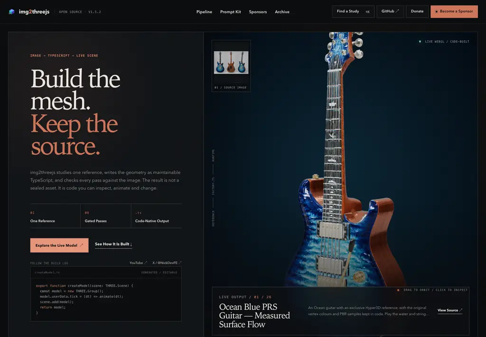
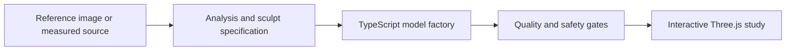

<div align="center">

# img2threejs Showcase

### Build the mesh. Keep the source.

Reference-led 3D studies rebuilt as inspectable, animation-ready Three.js code —
running live in the browser.

[](https://img2threejs.io/)
[](https://github.com/img2threejs/img2threejs)

[](https://github.com/img2threejs/img2threejs-showcase/stargazers)
[](https://github.com/img2threejs/img2threejs-showcase/actions/workflows/deploy.yml)
[](https://github.com/img2threejs/img2threejs-showcase/actions/workflows/pr-safety-check.yml)
[](https://threejs.org/)
[](https://github.com/img2threejs/img2threejs/releases)

<a href="https://img2threejs.io/">
  
</a>

<sub>Open a study, orbit the model, inspect its parts, trigger its actions, and follow the source back to the code.</sub>

[Gallery](https://img2threejs.io/) · [How it works](#from-reference-to-live-study) · [Contribute](#contributing-a-study) · [Develop](#local-development) · [Community](#community)

</div>

---

## About the showcase

This repository is the public gallery for [img2threejs](https://github.com/img2threejs/img2threejs).
Each study pairs its reference with a reviewable TypeScript implementation, catalog metadata,
and a live Three.js scene. The result is not a sealed render: it is code you can inspect,
diff, animate, and extend.

<table>
<tr>
<td width="33%" valign="top">
<strong>Reference-led</strong><br><br>
Silhouette, proportions, materials, and visible details are measured against the supplied source.
</td>
<td width="33%" valign="top">
<strong>Code-owned</strong><br><br>
Runtime geometry and behavior live in the repository. Demo code cannot depend on remote meshes, CDNs, or network calls.
</td>
<td width="33%" valign="top">
<strong>Animation-ready</strong><br><br>
Named parts, pivots, rigs, contact pairs, and effects are authored for interaction rather than flattened into a single asset.
</td>
</tr>
</table>

The catalog keeps honest status metadata: **final** entries are completed reconstructions;
**placeholder** entries remain visible while their final rebuild is in progress. The live source
of truth is [`src/demos/registry.ts`](src/demos/registry.ts).

## Recent studies

| Study | What to explore |
| --- | --- |
| [Ocean Blue PRS Guitar](https://img2threejs.io/#/demo/prs-ocean) | Measured vertex color and PBR samples preserved in code, six addressable strings, and opt-in water-flow actions. |
| [Groot — Heart of the Forest](https://img2threejs.io/#/demo/monster-tree) | A navigable woodland scene with retargeted movement, grounded combat, living-wood effects, and lantern spirits. |
| [Mars Cat](https://img2threejs.io/#/demo/mars-cat) | Seventeen measured regions streamed at three quality levels without shipping the reference GLB, textures, or UV atlas. |
| [Starship + Super Heavy](https://img2threejs.io/#/demo/starship-super-heavy) | Procedural stainless shells, heat-shield tiles, flaps, grid fins, engine arrays, and a staged separation sequence. |

<div align="center">

[Browse every live study](https://img2threejs.io/#archive)

</div>

## Gallery snapshots

<table>
<tr>
<td width="50%" align="center" valign="top">
<a href="https://img2threejs.io/#/demo/sony-wf1000xm3"></a><br>
<strong><a href="https://img2threejs.io/#/demo/sony-wf1000xm3">Sony WF-1000XM3</a></strong><br>
<sub>Open the case, lift both earbuds, spin them through a full turn, and settle them back into place.</sub>
</td>
<td width="50%" align="center" valign="top">
<a href="https://img2threejs.io/#/demo/gerber-knife"></a><br>
<strong><a href="https://img2threejs.io/#/demo/gerber-knife">Gerber Paracord Knife</a></strong><br>
<sub>A stonewashed tanto profile, skeletonized tang, hex pommel, and woven orange cord.</sub>
</td>
</tr>
<tr>
<td width="50%" align="center" valign="top">
<a href="https://img2threejs.io/#/demo/doraemon-house"></a><br>
<strong><a href="https://img2threejs.io/#/demo/doraemon-house">Doraemon House</a></strong><br>
<sub>An isometric street diorama with layered roofs, overhead wires, a garden, and animated atmosphere.</sub>
</td>
<td width="50%" align="center" valign="top">
<a href="https://img2threejs.io/#/demo/warhauler"></a><br>
<strong><a href="https://img2threejs.io/#/demo/warhauler">War-Hauler “SECTOR 07”</a></strong><br>
<sub>A weathered six-wheel hauler with a riveted plow, reactor-lit hubs, and drifting exhaust.</sub>
</td>
</tr>
</table>

## From reference to live study



1. **Study the source.** Record visible proportions, silhouette, material behavior, and unknown depth.
2. **Build in code.** Assemble geometry, materials, named parts, and optional actions in a TypeScript factory.
3. **Measure the result.** Compare the render with the source, document inference, and iterate on the largest visible gaps.
4. **Publish the study.** Add catalog metadata and a local reference; CI builds the gallery and runs the static safety gate.

For the reconstruction workflow itself, start with the
[img2threejs repository](https://github.com/img2threejs/img2threejs).

## Contributing a study

Have an img2threejs model worth sharing? The repository includes a scaffold command and a
purpose-built contribution path.

```bash
git clone https://github.com/<your-user>/img2threejs-showcase.git
cd img2threejs-showcase
npm ci

git switch -c add-demo/<id>
npm run new-demo -- <id> "<Title>" object   # or: character

# Add the factory and reference, then complete the generated registry entry.
npm run build
node scripts/check-showcase-safety.mjs --base main
```

A submission must:

- build its runtime geometry in code without fetching remote meshes, textures, fonts, or scripts;
- include a reference image you have the right to use (`.png`, `.jpg`, `.jpeg`, or `.webp`, at most 800 KB);
- use a unique kebab-case id and complete every required registry field;
- set `status: 'final'` once the real implementation replaces the scaffold;
- pass both the production build and the same safety scan used by CI.

Read the full [contribution guide](CONTRIBUTING.md) before opening a pull request.

## Local development

### Requirements

- Node.js 20
- npm

### Commands

```bash
npm ci
npm run dev            # start Vite in development mode
npm run build          # run project checks, TypeScript, and the production build
npm run preview        # serve the production build locally
npm run new-demo -- --help
npm run star-history   # regenerate the chart below; requires GITHUB_TOKEN
```

The gallery uses hash routes (`#/` and `#/demo/:id`) so direct navigation remains compatible
with static hosting.

## Repository map

```text
src/
  main.ts                 application bootstrap and route mounting
  content.ts              editorial copy for the gallery shell
  site-data.ts            canonical links, release, sponsor, and roadmap data
  pages/demo.ts           study viewer and information panel
  pages/workbench.ts      inspection and export workbench
  scene.ts                renderer, camera, controls, lighting, and disposal
  exporters.ts            browser-side export flows
  demos/registry.ts       catalog metadata and lazy runtime loaders
  demos/<id>/             one implementation folder per study
public/references/         local source references used by the catalog
scripts/
  new-showcase.mjs         contributor scaffold
  check-showcase-safety.mjs static pull-request safety gate
  generate-star-history.mjs repository-owned star chart generator
```

### Quality gates

Pull requests targeting `main` run the shared Node 20 quality workflow. The repository adds
showcase-specific checks for unsafe network access, reference formats and sizes, catalog ids,
and contribution boundaries. Merged changes are deployed automatically.

## Community

- [Discord](https://discord.gg/8DS8RTyuR) — feedback, reconstruction discussion, and work-in-progress studies
- [Issue tracker](https://github.com/img2threejs/img2threejs-showcase/issues) — gallery bugs and showcase submissions
- [YouTube](https://www.youtube.com/@hoainho1465) · [X / @NickDevFE](https://x.com/NickDevFE) — build logs and releases

## Support the project

img2threejs and this gallery are open source. If they save you time, you can support ongoing
work through [Ko-fi](https://ko-fi.com/iamnick) or the
[project donation page](https://img2threejs.io/donate.html).

## Star history

<div align="center">

<a href="https://github.com/img2threejs/img2threejs-showcase/stargazers">
  <picture>
    <source media="(prefers-color-scheme: dark)" srcset=".github/readme-assets/star-history-dark.svg">
    <source media="(prefers-color-scheme: light)" srcset=".github/readme-assets/star-history-light.svg">
    
  </picture>
</a>

<sub>Generated in-repository by <a href="scripts/generate-star-history.mjs"><code>scripts/generate-star-history.mjs</code></a> and refreshed daily.</sub>

</div>
